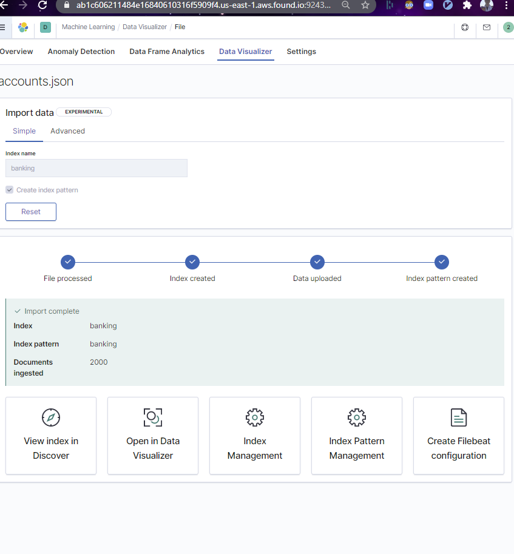
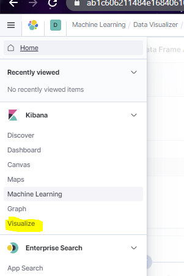
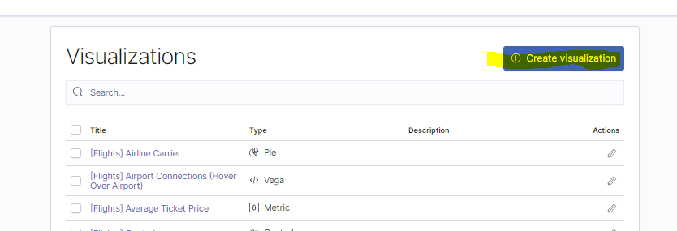
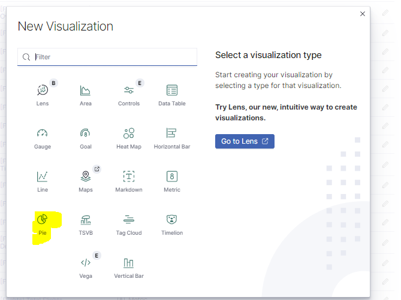
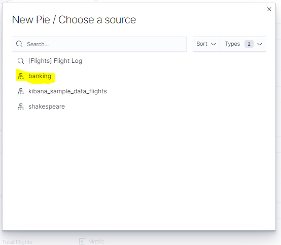
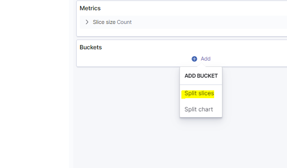
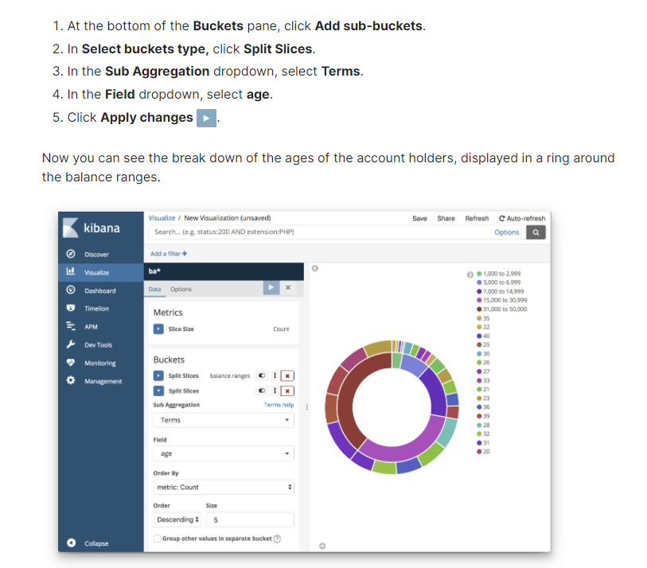

# Breakout Session 2

## Banking

### Overview

We will sift through sample banking data from account holders and look at the distribution of funds. 

### Concepts

- Bucketing Data
- Applying ELK for Demographics

### Instructions

1. Import the banking data `account.json` with the `Machine Learning` `Data Visualizer` as you learned to do in Breakout Session 1.

2. Click the `hamburger menu` and click `Visualize`

3. Click `Create Visualization`

4. Choose `Pie` for a pie chart

5. Choose `banking` as your source index

6. Click `+ Add` under `buckets` and choose `Split Slices'

7. Choose `range` for your `Aggregation`

Enter the following ranges to split the slices.

8. Extra credit: Add demographic data (challenge!)

