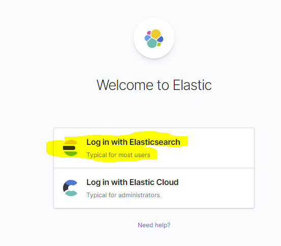
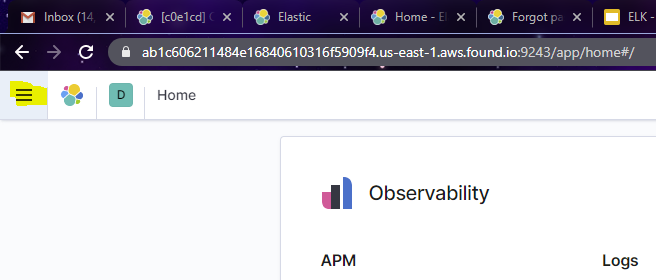
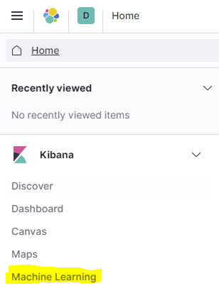
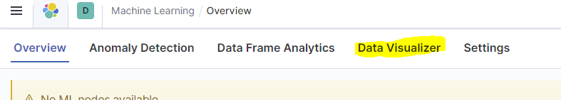
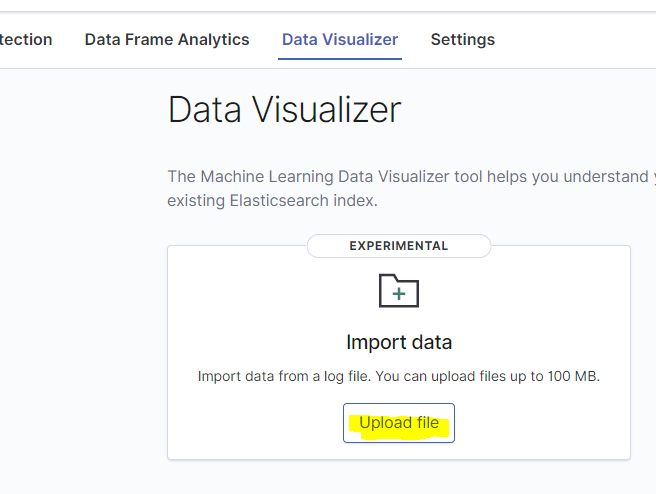
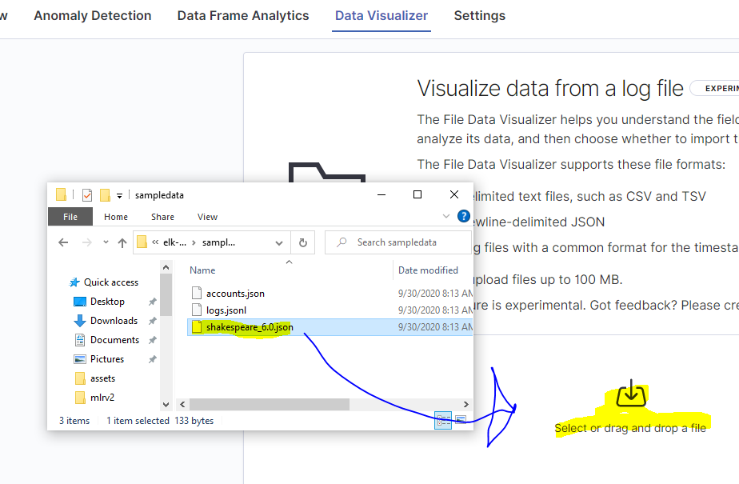

# Breakout Session 1

## Shakespeare

### Summary

This lab involves analyzing all the lines from all the characters in Shakespeare.

### Concepts

- Importing Data
- Exploring Basic Visualizations

### Instructions

**1. Visit the appropriate ELK Url for your team.**

- Cyan: https://cyan.mi7.dev
- Magenta: https://magenta.mi7.dev
- Yellow: https://yellow.mi7.dev

**2. Click `Log in with Elasticsearch`**

**3. Log in with the credentials you got during pre-prep.**

**4. Click the `hamburger menu` at the top left**

**5. Click `Machine Learning`**

**6. Click `Data Visualizer`**

**7. Click `Upload File`**

**8. Drag 'n Drop `shakespeare.json` in (will have a slightly diff name than in the below picture):**

