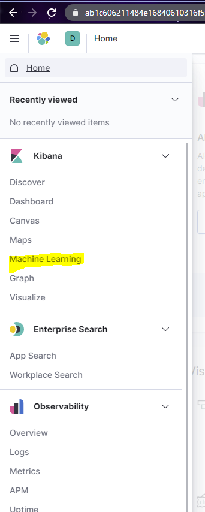

# Breakout Session 1

## Shakespeare

### Summary

This lab involves analyzing all the lines from all the characters in Shakespeare.

### Concepts

- Importing Data
- Exploring Basic Visualizations

### Instructions

1. Visit the appropriate ELK Url for your team.

- Cyan: https://cyan.mi7.dev
- Magenta: https://magenta.mi7.dev
- Yellow: https://yellow.mi7.dev

2. Click `Log in with Elasticsearch`

2. Log in with the credentials you got during pre-prep.

3. Click the 'hamburger' menu at the top left

4. Click `Machine Learning`

