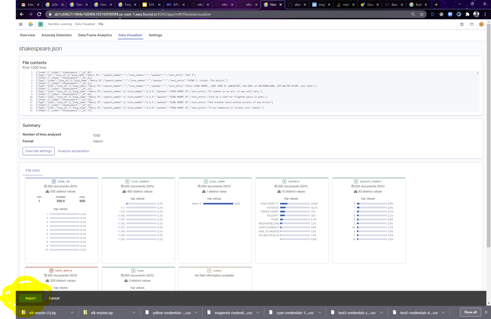
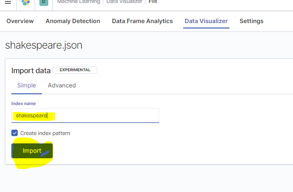
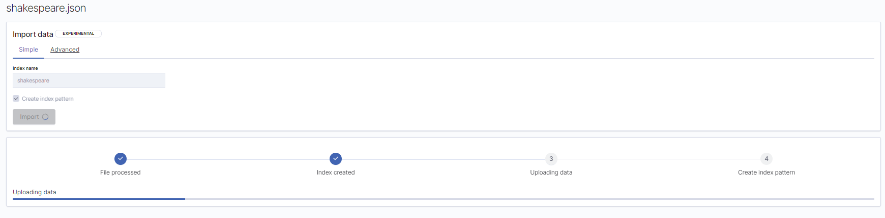
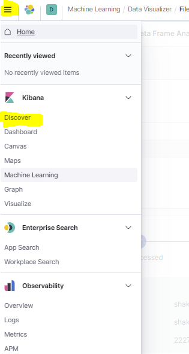
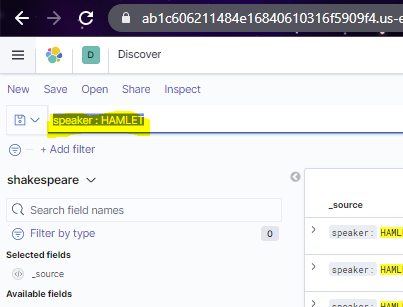
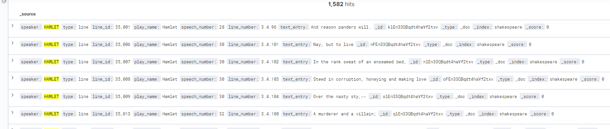
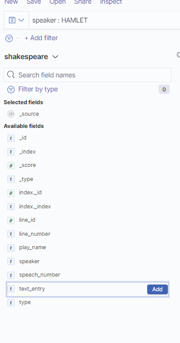
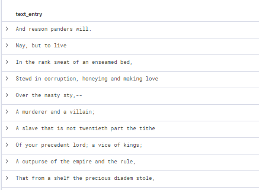

# Breakout Session 1

## Shakespeare

### Summary

This lab involves analyzing all the lines from all the characters in Shakespeare.

### Concepts

- Importing Data
- Exploring Basic Visualizations

### Instructions

**1. Visit the appropriate ELK Url for your team.**

- Cyan: https://cyan.mi7.dev
- Magenta: https://magenta.mi7.dev
- Yellow: https://yellow.mi7.dev

**2. Click `Log in with Elasticsearch`**

**3. Log in with the credentials you got during pre-prep.**

**4. Click the `hamburger menu` at the top left**

**5. Click `Machine Learning`**

**6. Click `Data Visualizer`**

**7. Click `Upload File`**

**8. Drag 'n Drop `shakespeare.json` in (will have a slightly diff name than in the below picture):**

**9. Click `Import` This is very important.**

**10. Name your index `shakespeare`. Do not forget to click `Import` again.**

**11. Wait while Kibana 'does its magic'. When it is done you can go to the next step.**

**12. Open up the `hamburger` menu on the left and go to `Discover`.**

**13. We are now going to start exploring the Shakespeare data. We will start by seeing all lines spoken by the character HAMLET type `speaker : HAMLET` in the search bar. Then press `enter`**

**14. Hmm the lines look a little cluttered.**

**Let's fix that. Hover over `text_entry`, the field with each characters lines, and click the `add` button that appears on mouse-over**

**That's better!**

